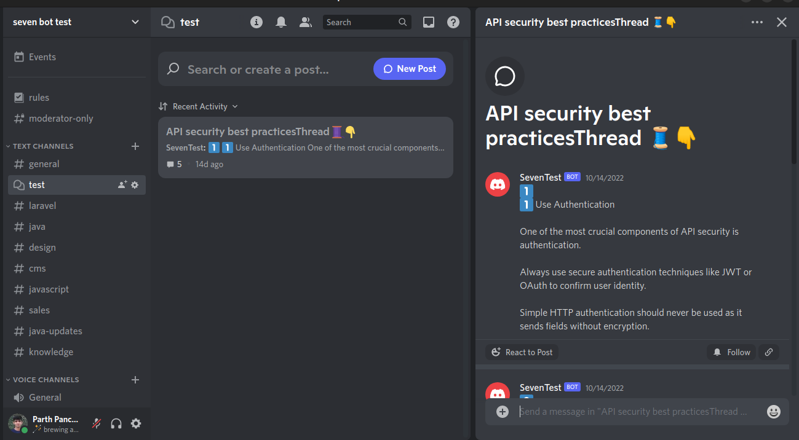

# Thread mapper (Twitter to Discord)
Python bot to map Twitter thread to discord Thread. 

## Installation

### Create discord application in developer portal
1. Open the [Discord developer portal](https://discord.com/developers/applications) and log into your account.
2. Select "New Application" from the menu.
3. Type a name into the pop-up window and click "Create" to confirm.
4. Use the left-side menubar to access the Bot menu.
5. Add a single bot, configure the access token, and then keep it somewhere for future usage.
6. In the menu on the left, select OAuth2 > URL Generator.
7. Choose Bot in the scopes area and check the below boxes in the permissions options.

8. Next, paste the generated URL into your browser and invite your bot to your server.
9. Now, in your discord sever create one channel with `Channel Type Forum` and paste its channel ID in `constants.py` file

### Project Setup
1. Login to your Twitter developer portal and create one project.
2. Inside your project add one app and obtain all the required tokens.
3. Now clone this repo in your workspace.
```shell
git clone https://github.com/parth-p-7span/thread-mapper.git
```
4. Navigate to thread-mapper directory in your terminal
```shell
cd thread-mapper
```
5. Install required packages using below command
```shell
pip install -r requirements.txt
```
6. Create one file called `.env` in root directory of project and add your secret tokens and credentials. [Tap Here](https://gist.githubusercontent.com/parth-p-7span/bca51612e5637ae511a48b791e15144b/raw/3550b59ec3f10394dd06b24881b732593008673d/thread-mapper.env) for sample file.
7. Now run `main.py` file
```shell
python main.py
```

## Usage
Simply mention your Twitter bot in the last tweet of the thread to use this system.<br>
You will receive the output after doing that.
